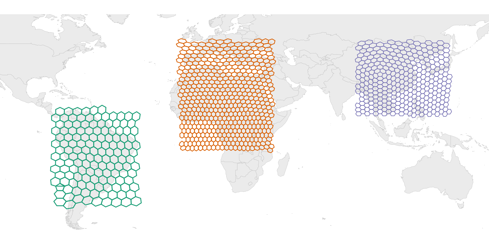

# hexify

[](https://CRAN.R-project.org/package=hexify)
[](https://cran.r-project.org/package=hexify)
[](https://cran.r-project.org/package=hexify)
[](https://github.com/gcol33/hexify/actions/workflows/R-CMD-check.yaml)
[](https://app.codecov.io/gh/gcol33/hexify)
[](https://opensource.org/licenses/MIT)

**Hexagonal Grids for Global Spatial Analysis — ISEA + H3**

<p align="center">
  
</p>

The `hexify` package provides fast, accurate assignment of geographic coordinates to hexagonal grid cells. It supports two grid systems: **ISEA** (Icosahedral Snyder Equal Area) for guaranteed equal-area cells, and **H3** (Uber's hierarchical hex system) for compatibility with industry-standard workflows like FCC broadband mapping. Whether you're aggregating species occurrences, analyzing point patterns, or preparing data for spatial modeling, `hexify` gives you one consistent interface for both systems.

## Quick Start

```r
library(hexify)

cities <- data.frame(
  name = c("Vienna", "Paris", "Madrid"),
  lon = c(16.37, 2.35, -3.70),
  lat = c(48.21, 48.86, 40.42)
)

# ISEA equal-area grid (default)
grid <- hex_grid(area_km2 = 10000)
result <- hexify(cities, lon = "lon", lat = "lat", grid = grid)
plot(result)

# H3 grid (Uber's system)
h3_grid <- hex_grid(resolution = 4, type = "h3")
result_h3 <- hexify(cities, lon = "lon", lat = "lat", grid = h3_grid)
plot(result_h3)
```

## Statement of Need

Spatial binning is fundamental to ecological modeling, epidemiology, and geographic analysis. Standard approaches using rectangular lat-lon grids introduce severe area distortions: a 1° cell at the equator covers ~12,300 km², while the same cell near the poles covers a fraction of that area. This violates the equal-sampling assumption underlying most spatial statistics.

Discrete Global Grid Systems (DGGS) solve this by partitioning Earth's surface into cells of uniform area. hexify implements two hex grid systems:

- **ISEA** — True equal-area hexagonal grids with apertures 3, 4, 7, or mixed 4/3. Fast C++ implementation. Compatible with dggridR cell IDs.
- **H3** — Uber's hierarchical hexagonal system (resolutions 0–15). Industry standard used by the FCC, Foursquare, and others. Powered by the `h3o` package.

Both systems share the same interface: `hexify()`, `cell_to_sf()`, `grid_rect()`, `get_parent()`, `get_children()`, and all other functions work with either grid type.

These features make hexify suitable for:

- Species distribution modeling and biodiversity assessments
- Epidemiological surveillance and disease mapping
- Environmental monitoring and remote sensing aggregation
- Any analysis requiring unbiased spatial binning

## Features

### Core Workflow

- **`hex_grid()`**: Define a grid by target cell area (km²) or resolution level
- **`hexify()`**: Assign points to grid cells (data.frame or sf input)
- **`plot()` / `hexify_heatmap()`**: Visualize results with base R or ggplot2

### Grid Generation

- **`grid_rect()`**: Generate cell polygons for a bounding box
- **`grid_global()`**: Generate a complete global grid (all cells)
- **`grid_clip()`**: Clip grid to a polygon boundary (country, region, etc.)

### Cell Operations

- **`cell_to_sf()`**: Convert cell IDs to sf polygon geometries
- **`cell_to_lonlat()`**: Get cell center coordinates
- **`get_parent()` / `get_children()`**: Navigate grid hierarchy

### Interoperability

- **`as_dggrid()` / `from_dggrid()`**: Convert to/from dggridR format
- **`as_sf()`**: Export HexData to sf object
- **`as.data.frame()`**: Extract data with cell assignments
- **H3 support**: `hex_grid(resolution = 8, type = "h3")` — requires `h3o` package

## Installation

```r
# Install from CRAN
install.packages("hexify")

# Or install development version from GitHub
# install.packages("pak")
pak::pak("gcol33/hexify")
```

## Usage Examples

### Basic Point Assignment

```r
library(hexify)

# Define grid: ~10,000 km² cells
grid <- hex_grid(area_km2 = 10000)
grid
#> HexGridInfo: aperture=3, resolution=5, area=12364.17 km²

# Assign coordinates to cells
coords <- data.frame(
  lon = c(-122.4, 2.35, 139.7),
  lat = c(37.8, 48.9, 35.7)
)
result <- hexify(coords, lon = "lon", lat = "lat", grid = grid)

# Access cell IDs
result@cell_id
```

### Working with sf Objects

```r
library(sf)

# Any CRS works - hexify transforms automatically
points_sf <- st_as_sf(coords, coords = c("lon", "lat"), crs = 4326)
result <- hexify(points_sf, area_km2 = 10000)

# Export back to sf
result_sf <- as_sf(result)
```

### Generating Grid Polygons

```r
# Grid for Europe
grid <- hex_grid(area_km2 = 50000)
europe_hexes <- grid_rect(c(-10, 35, 40, 70), grid)
plot(europe_hexes["cell_id"])

# Clip to a country boundary
library(rnaturalearth)
france <- ne_countries(country = "France", returnclass = "sf")
france_grid <- grid_clip(france, grid)
```

### Aggregating Point Data

```r
# Species occurrence data
occurrences <- data.frame(
  species = sample(c("Sp A", "Sp B", "Sp C"), 1000, replace = TRUE),
  lon = runif(1000, -10, 30),
  lat = runif(1000, 35, 60)
)

# Assign to grid
grid <- hex_grid(area_km2 = 20000)
occ_hex <- hexify(occurrences, lon = "lon", lat = "lat", grid = grid)

# Count per cell
occ_df <- as.data.frame(occ_hex)
occ_df$cell_id <- occ_hex@cell_id

cell_counts <- aggregate(species ~ cell_id, data = occ_df, FUN = length)
names(cell_counts)[2] <- "n_records"

# Richness per cell
richness <- aggregate(species ~ cell_id, data = occ_df,
                      FUN = function(x) length(unique(x)))
names(richness)[2] <- "n_species"
```

### Visualization

```r
# Quick plot
plot(result)

# Heatmap with basemap
hexify_heatmap(occ_hex, value = "n_records", basemap = TRUE)

# Custom ggplot
library(ggplot2)
cell_polys <- cell_to_sf(cell_counts$cell_id, grid)
cell_polys <- merge(cell_polys, cell_counts, by = "cell_id")

ggplot(cell_polys) +
  geom_sf(aes(fill = n_records), color = "white", linewidth = 0.2) +
  scale_fill_viridis_c() +
  theme_minimal()
```

## Documentation

- [Quick Start](https://gillescolling.com/hexify/articles/quickstart.html) - Basic concepts and workflow
- [Visualization](https://gillescolling.com/hexify/articles/visualization.html) - Plotting with base R and ggplot2
- [Workflows](https://gillescolling.com/hexify/articles/workflows.html) - Grid generation, clipping, multi-resolution analysis

## Support

> "Software is like sex: it's better when it's free." — Linus Torvalds

I'm a PhD student who builds R packages in my free time because I believe good tools should be free and open. I started these projects for my own work and figured others might find them useful too.

If this package saved you some time, buying me a coffee is a nice way to say thanks. It helps with my coffee addiction.

[](https://buymeacoffee.com/gcol33)

## Citation

```bibtex
@software{hexify,
  author = {Colling, Gilles},
  title = {hexify: Equal-Area Hexagonal Grids for Spatial Analysis},
  year = {2025},
  url = {https://CRAN.R-project.org/package=hexify},
  doi = {10.32614/CRAN.package.hexify}
}
```

## License

MIT (see LICENSE.md)
